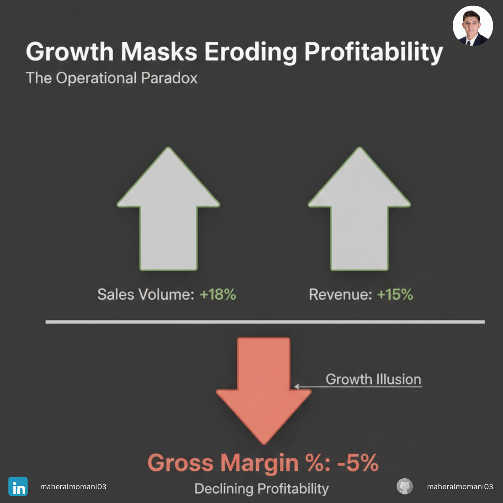

# Case #1: 40% Growth and the Discount Trap

### 📝 Technical Analysis
In this scenario, the management focused on "Top-Line Growth" (Revenue) while neglecting the "Unit Economics." By offering aggressive discounts to drive a 40% increase in volume, the company failed to account for the **Price Elasticity of Profit**. 

From a **CMA (Certified Management Accountant)** perspective, this is a failure in **CVP (Cost-Volume-Profit) Analysis**. Dropping the price by 10% often requires a much larger jump in volume than expected just to maintain the same absolute Gross Profit, especially if variable costs are high.

### 💡 The Correct Action
1. **Sensitivity Analysis:** Before any discount campaign, model the "Minimum Volume Jump" required to offset the margin drop.
2. **Margin-Based Incentives:** Tie bonuses to "Gross Profit Dollars" rather than "Revenue" or "Volume."
3. **Data-Driven Pricing:** Use segment-specific pricing instead of blanket discounts that erode the core margin.

---
**Maher AL-Momani** [LinkedIn Profile](https://www.linkedin.com/in/YOUR_PROFILE_LINK)
