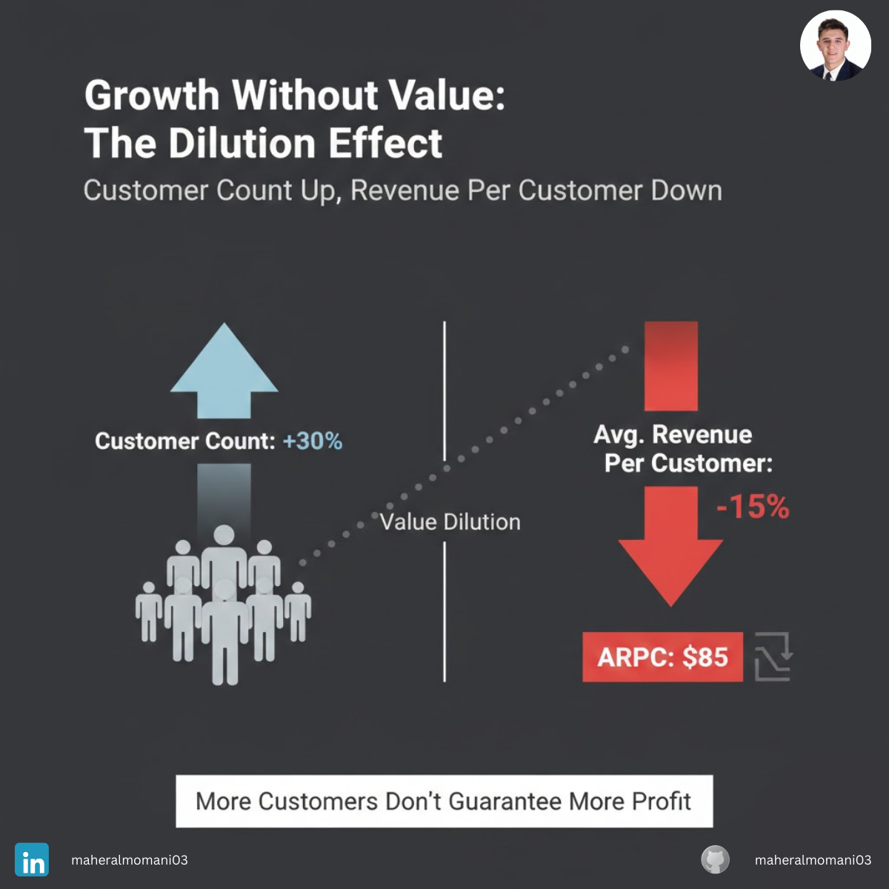

# Case #4: Customer Volume vs. Transaction Value

### 📝 Technical Analysis
This case demonstrates the hidden dangers of "Diluted Customer Quality." While the sales funnel is performing well in terms of volume, the **Average Revenue Per User (ARPU)** is declining. Mathematically, the relationship is expressed as:

$$ARPU = \frac{Total\ Revenue}{Total\ Number\ of\ Customers}$$

From a **CMA (Certified Management Accountant)** perspective, this creates an operational efficiency crisis. If the marginal cost to serve a customer (shipping, support, processing) remains constant while the transaction value decreases, the **Contribution Margin per Unit** shrinks. Eventually, the company reaches a point where it is "scaling losses"—the more customers it gains, the less profitable it becomes.

### 💡 The Correct Action
1. **Minimum Order Value (MOV):** Implement a minimum order threshold to ensure every transaction covers its own variable and fixed operational costs.
2. **Customer Segmentation:** Use data analysis to identify the "High-Value" segment and refocus marketing spend on acquiring similar profiles.
3. **Up-selling & Cross-selling:** Train sales teams and optimize the digital journey to increase the "Basket Size" through relevant recommendations.
4. **Profitability Audit:** Calculate the "Customer Acquisition Cost (CAC)" vs. "Lifetime Value (LTV)" specifically for the new low-value segment to see if they are worth keeping.

---
**Maher AL-Momani** | [LinkedIn Profile](https://www.linkedin.com/in/maheralmomani03/)
