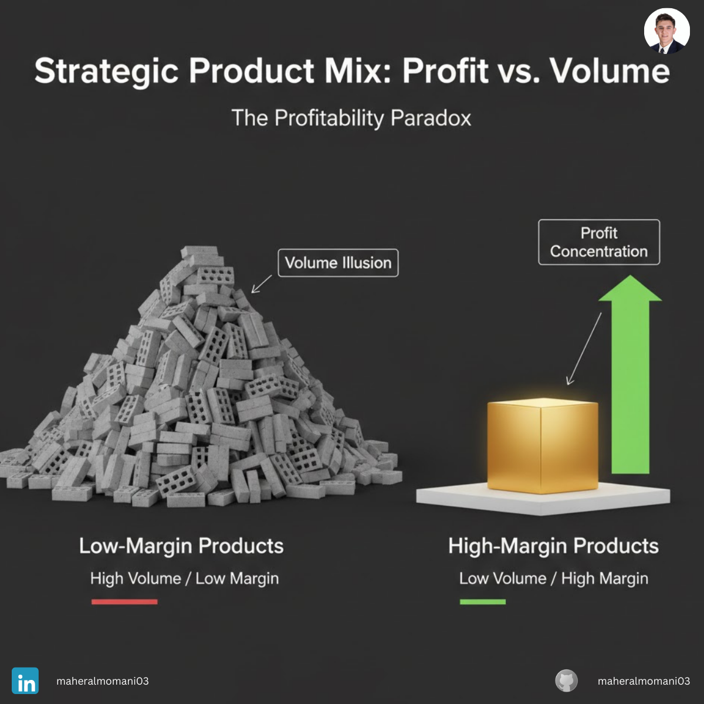

# Case #5: The Low-Margin Product Trap

### 📝 Technical Analysis
This case explores the "Product Mix Variance" and its impact on the weighted average margin. When a company experiences a shift in sales toward lower-margin products, it can achieve record-breaking revenue while simultaneously experiencing a "Margin Compression" crisis. 

From a CMA (Certified Management Accountant) perspective, the focus should be on the Sales Mix Analysis. If the Entry-Level products consume more warehouse space, logistics, and support resources than the Premium line, the true "Net Margin" might even be negative once fixed costs are allocated. Revenue is growing, but the "Quality of Earnings" is deteriorating.

### 💡 The Correct Action
1. Margin-Based Commissions: Transition the sales team from revenue-based targets to "Gross Margin Contribution" targets.
2. Product Rationalization: Review the low-margin portfolio; if a product doesn't lead to future high-margin sales (upselling), consider discontinuing it.
3. Activity-Based Costing (ABC): Perform a deep dive into the hidden costs of high-volume, low-margin orders to ensure they aren't actually loss-making.
4. Strategic Pricing: Implement price increases on low-margin high-volume items to test price elasticity and recover margin.

---
**Maher AL-Momani** | [LinkedIn Profile](https://www.linkedin.com/in/maheralmomani03/)
