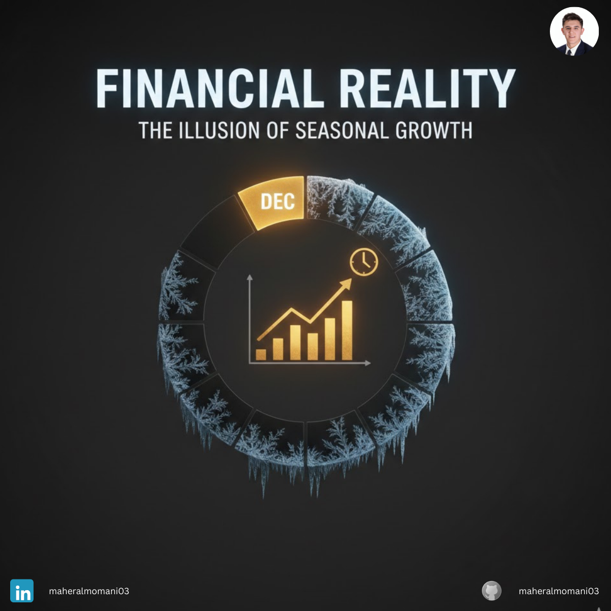
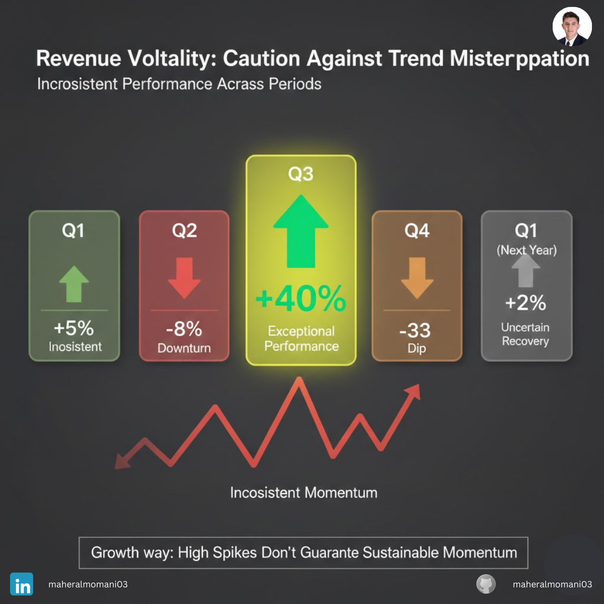

# Case #8: The Illusion of Seasonal Growth

### 📝 Technical Analysis
This case highlights a failure in Time Series Analysis and the neglect of "Deseasonalizing" data. Management fell into the trap of Extrapolation Bias, assuming that a short-term trend (Seasonal Spike) would continue linearly. In retail, failing to distinguish between Cyclical, Seasonal, and Trend components leads to severe forecasting errors.

From a CMA (Certified Management Accountant) perspective, this is a breakdown in Budgeting and Forecasting integrity. By comparing Q4 to Q3 (Quarter-over-Quarter) instead of Q4 to the previous year's Q4 (Year-over-Year), the company ignored the historical seasonality of the business. This led to an over-investment in "Working Capital" (Inventory) and "Fixed Costs" (Headcount), significantly increasing the company's operating leverage and financial risk during the subsequent low-demand periods.

### 💡 The Correct Action
1. YoY Performance Benchmarking: Always prioritize Year-over-Year (YoY) comparisons over Quarter-over-Quarter (QoQ) to filter out seasonal noise.
2. Deseasonalized Modeling: Use statistical methods (like Moving Averages or Seasonal Indices) to identify the "Underlying Trend" behind the raw sales data.
3. Flexible Resource Allocation: Use temporary labor or variable-cost logistics during peak seasons instead of increasing permanent fixed costs.
4. Inventory Buffer Management: Align inventory procurement with historical demand cycles rather than immediate short-term sales velocity.

---
**Maher AL-Momani** | [LinkedIn Profile](https://www.linkedin.com/in/maheralmomani03/)
