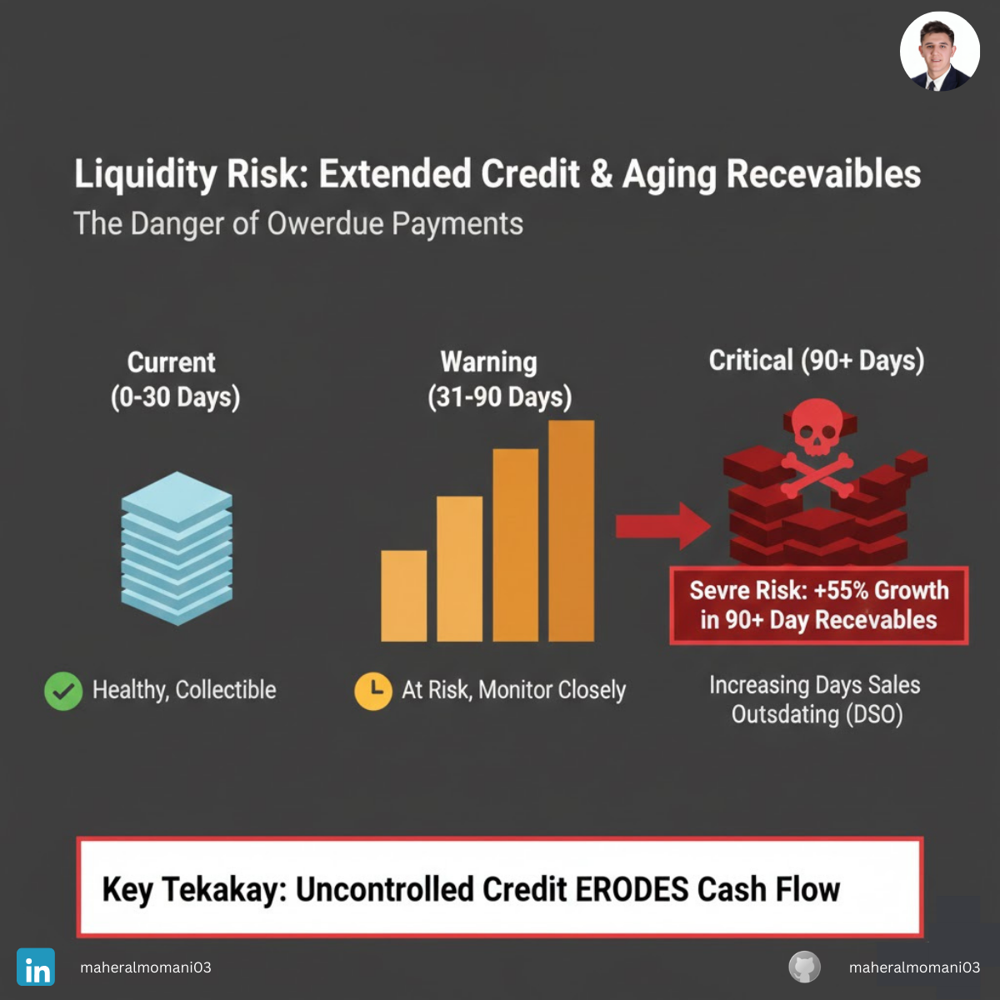

# Case #9: Extended Payment Terms and Artificial Growth

### 📝 Technical Analysis
This case illustrates the danger of using "Credit Policy" as a primary sales tool. While extending payment terms can temporarily boost Revenue, it often attracts lower-quality customers who cannot secure financing elsewhere. This leads to "Artificial Growth" where the Income Statement looks healthy (Accrual Basis), but the Balance Sheet is accumulating toxic assets.

From a CMA (Certified Management Accountant) perspective, the focus shifts to the Quality of Earnings. A significant increase in the Average Collection Period and a ballooning AR Aging bucket over 90 days indicates that the Revenue recognized might not be "Realizable." Under the matching principle, the company must also significantly increase its Allowance for Doubtful Accounts, which often wipes out the net profit gained from the extra sales.

### 💡 The Correct Action
1. Credit Risk Re-assessment: Perform an immediate credit audit on all accounts with terms exceeding 60 days and tighten limits for high-risk segments.
2. DSO vs. Revenue Targets: Align executive KPIs to include "Days Sales Outstanding (DSO)" alongside revenue growth to prevent reckless credit extension.
3. Early Payment Incentives: Offer "Cash Discounts" (e.g., 2/10 Net 30) to pull cash forward and reduce the aging of the receivables portfolio.
4. Non-Recourse Factoring: For high-risk outstanding balances, consider factoring to transfer the credit risk to a third party, even if it comes at a cost to the margin.

---
**Maher AL-Momani** | [LinkedIn Profile](https://www.linkedin.com/in/maheralmomani03/)
