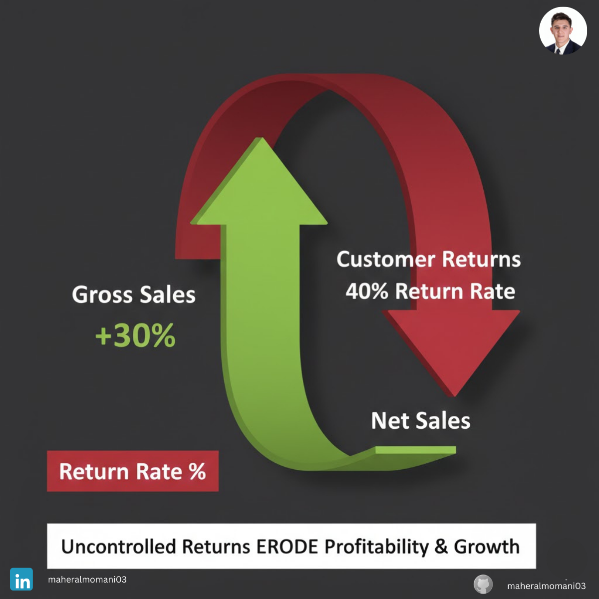

# Case #10: Revenue Growth and the Return Explosion

### 📝 Technical Analysis
This case illustrates the danger of focusing on "Gross Revenue" as a primary KPI without monitoring "Contra-Revenue" accounts. In financial accounting, Sales Returns and Allowances are subtracted from Gross Sales to arrive at **Net Sales**. When returns explode, they don't just reduce revenue; they create a double-loss through wasted shipping costs, restocking labor, and potential inventory damage.

From a **CMA (Certified Management Accountant)** perspective, this represents a breakdown in "Quality Control" and "Marketing Integrity." If the Return Rate exceeds the industry benchmark, the "Revenue Recognition" becomes unreliable. The company is essentially incurring all the variable costs of a sale without the benefit of the final cash inflow, leading to a massive drain on working capital and net profitability.

### 💡 The Correct Action
1. **Net Sales Reporting:** Switch all executive dashboards to report "Net Sales" (post-returns) as the primary growth metric instead of Gross Sales.
2. **Root Cause Analysis:** Segment returns by "Reason Code" (e.g., Damaged, Not as Described, Late Delivery) to identify if the problem is in manufacturing or marketing.
3. **Marketing-Product Alignment:** Audit ad creatives to ensure product expectations are realistic, reducing the "Expectation-Reality Gap" for customers.
4. **Logistics Cost Recovery:** Analyze the "Reverse Logistics" costs and adjust pricing or return policies for high-return product categories to protect the bottom line.

---
**Maher AL-Momani** | [LinkedIn Profile](https://www.linkedin.com/in/maheralmomani03/)
