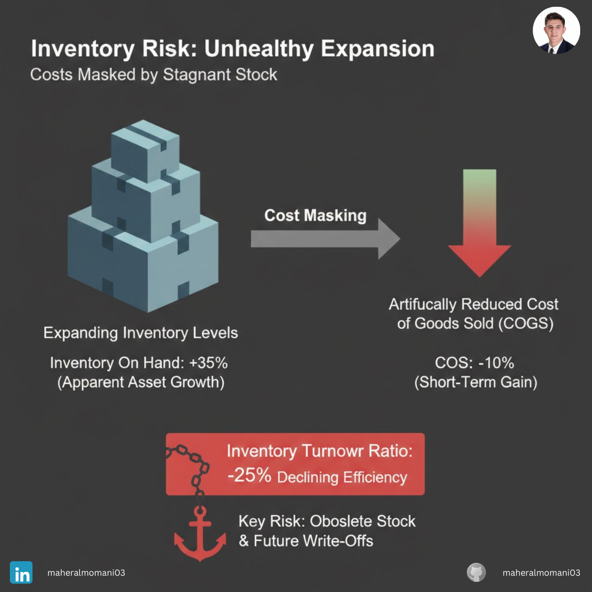

# Case #12: The Magic of Inventory Valuation

### 📝 Technical Analysis
This case explores the manipulation of the **Cost of Goods Sold (COGS)** formula:  
*COGS = Beginning Inventory + Purchases - Ending Inventory* By inflating the value of **Ending Inventory** (through aggressive overhead allocation or ignoring obsolescence), a company directly reduces its COGS, which in turn inflates Gross Profit and Net Income. This is a non-cash gain that creates a "tax bill" on profits that haven't been realized through actual sales.

From a **CMA (Certified Management Accountant)** perspective, the red flag here is the divergence between "Book Profit" and the **Inventory Turnover Ratio**. If the profit is rising while the turnover is slowing down (1.4x vs 2.5x), it indicates that the company is "capitalizing expenses" into inventory rather than expensing them. This lowers the quality of earnings and creates a massive risk of future write-downs.

### 💡 The Correct Action
1. **Inventory Turnover Benchmarking:** Monitor the turnover ratio monthly; any significant drop while margins improve requires an immediate audit.
2. **Standard Cost Review:** Regularly audit the "Overhead Absorption" rates to ensure they are based on realistic production levels, not just to hide costs in the warehouse.
3. **Obsolescence Testing:** Implement a strict policy for writing down slow-moving or obsolete stock to prevent "zombie inventory" from inflating the balance sheet.
4. **Consistency Principle Audit:** Ensure that any change in valuation methods (e.g., FIFO to Weighted Average) is fully disclosed and justified, rather than used as a tool for earnings management.

---
**Maher AL-Momani** | [LinkedIn Profile](https://www.linkedin.com/in/maheralmomani03/)
