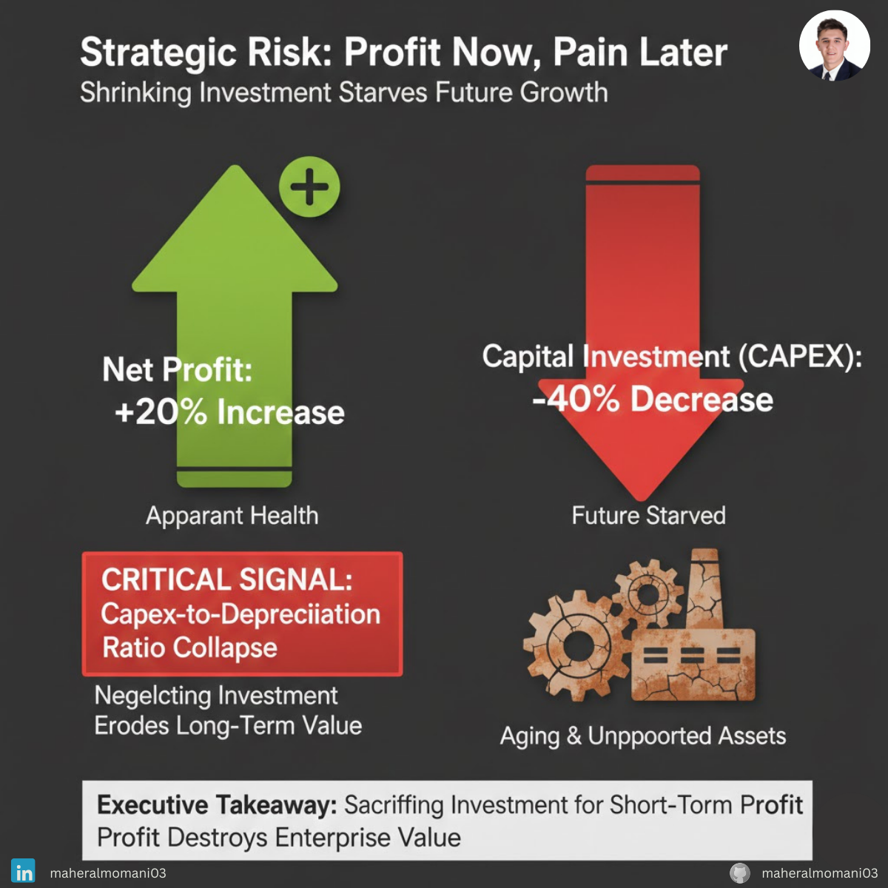

# Case #16: Profit at the Expense of Future Investment

### 📝 Technical Analysis
This case illustrates "Capital Starvation." In accounting, **Depreciation** represents the economic wearing out of assets over time. If a company's **Capital Expenditure (CapEx)** falls significantly below its Depreciation expense, it means the company is not even replacing the assets it is using up, let alone growing. This boosts short-term Net Income because the cash that should have gone into "Investing Activities" stays in the bank or is paid out as dividends.

From a **CMA (Certified Management Accountant)** perspective, the **Reinvestment Ratio** (CapEx / Depreciation) is a vital sign of long-term viability. A ratio below 1.0 for multiple periods suggests that the company is "Harvesting" its assets. While the P&L looks "efficient," the "Quality of Earnings" is extremely low because the business is becoming technologically obsolete and operationally fragile.

### 💡 The Correct Action
1. **Asset Lifecycle Audit:** Conduct a physical and technical audit of all core assets to determine the "True Remaining Life" and prevent sudden operational failures.
2. **Mandatory Reinvestment Floor:** Establish a policy that CapEx must remain at a minimum of 1.1x Depreciation to ensure the business maintains its productive capacity.
3. **R&D as a Fixed Commitment:** Treat a percentage of R&D as a non-discretionary expense to protect the company’s future market position from short-term budget cuts.
4. **Long-Term Incentive Plans (LTIP):** Align executive bonuses with "Return on Invested Capital (ROIC)" and 3-year growth targets rather than just the current year's Net Income.

---
**Maher AL-Momani** | [LinkedIn Profile](https://www.linkedin.com/in/maheralmomani03/)
