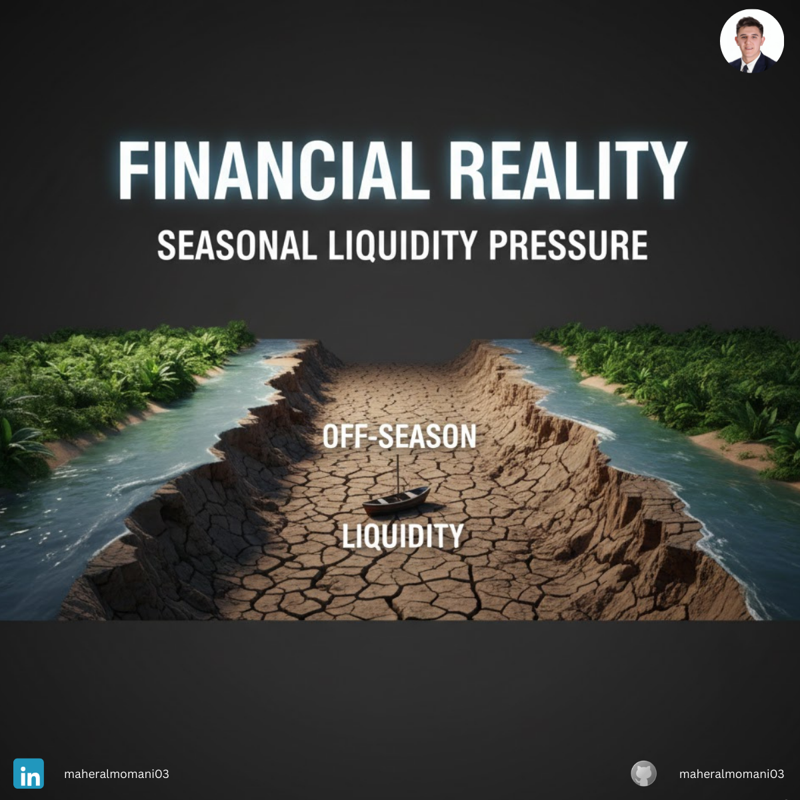
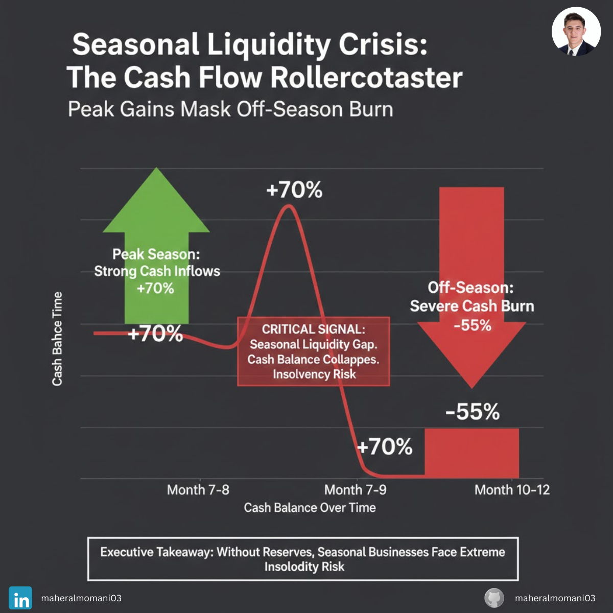

# Case #20: Seasonal Liquidity Pressure

### 📝 Technical Analysis
This case examines the "Timing Gap" between revenue recognition and cash obligations. In seasonal businesses, profit is often concentrated in a few peak months, while fixed costs and inventory payments are spread throughout the year. Relying on an annual P&L to judge business health is a strategic error that ignores the "Intra-year Liquidity Risk."

From a CMA (Certified Management Accountant) perspective, the core failure here is the absence of a **Rolling Cash Forecast**. Even a highly profitable firm can face technical insolvency if its "Cash Conversion Cycle" is not synchronized with its seasonal sales dip. The company has a "Working Capital" mismatch where current liabilities in the off-season exceed available cash, despite a positive net income at year-end.

### 💡 The Correct Action
1. **12-Month Rolling Cash Forecast:** Implement a detailed monthly cash budget to identify "Liquidity Valleys" at least six months in advance.
2. **Seasonal Credit Line:** Establish a "Standby Line of Credit" during peak performance months to cover shortfalls during the off-season.
3. **Variable Cost Structuring:** Convert fixed costs into variable costs (e.g., using temporary staff or outsourced logistics) to reduce the cash burn during low-revenue months.
4. **Staggered Payments:** Negotiate with suppliers to align inventory payment terms with the company’s peak cash inflow periods.

---
**Maher AL-Momani** | [LinkedIn Profile](https://www.linkedin.com/in/maheralmomani03/)
