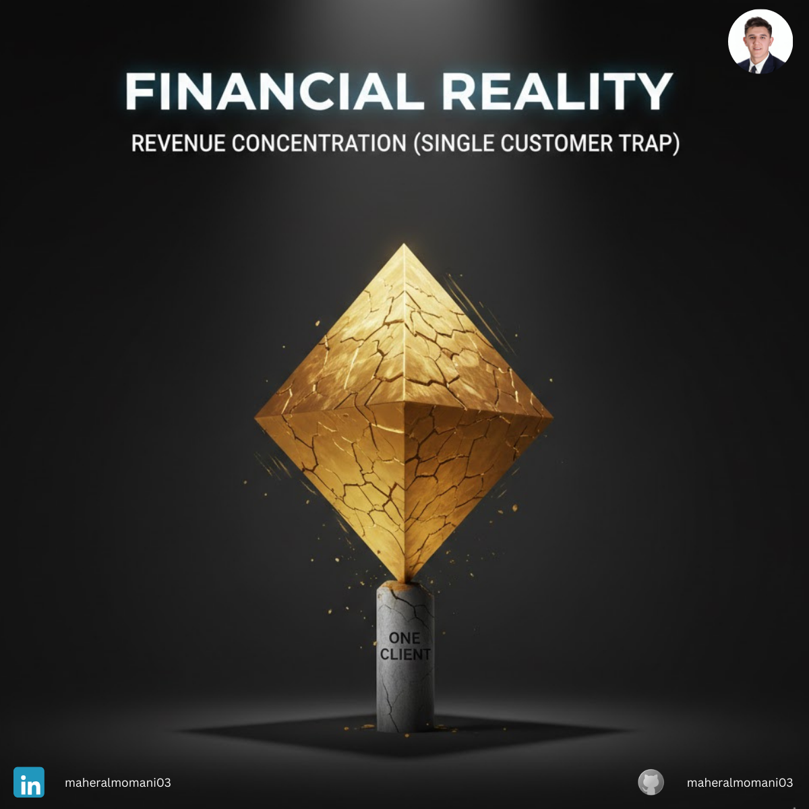
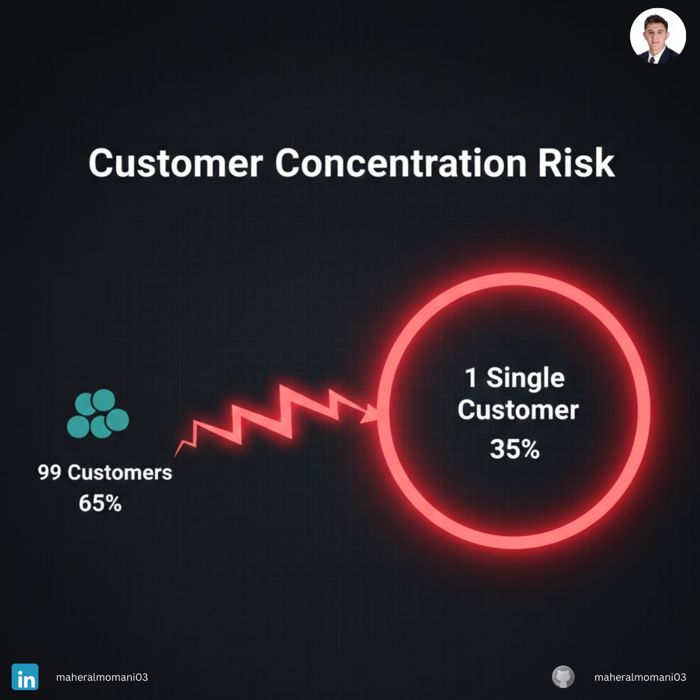

# Case #21: Revenue Concentration (Single Customer Trap)

### 📝 Technical Analysis
This case focuses on **Customer Concentration Risk**. When a single entity controls a significant portion of revenue (35% in this case), the company’s "Bargaining Power" is severely diminished. From a financial stability perspective, this creates high cash flow volatility. If the "Concentration Ratio" is too high, the company’s valuation drops because the risk of a sudden revenue collapse is factored in by investors.

### 💡 The Correct Action
1. **Revenue Cap Policy:** Set a strategic goal that no single customer should exceed 15-20% of total revenue.
2. **Aggressive Sales Diversification:** Pivot the sales team to focus on mid-market clients to balance the portfolio.
3. **Risk-Adjusted Valuation:** Factor in the cost of losing this client into your "Stress Test" financial models.

---
**Maher AL-Momani** | [LinkedIn Profile](https://www.linkedin.com/in/maheralmomani03/)
