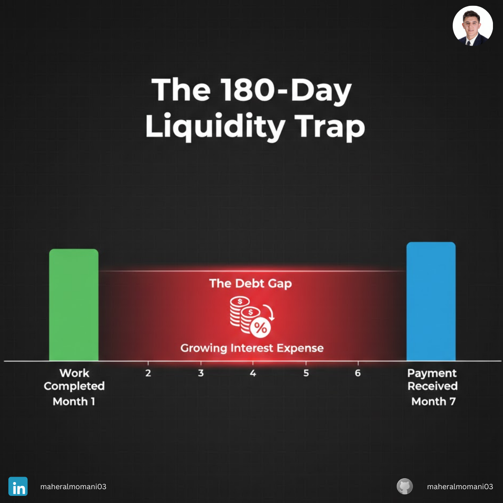

# Case #28: Cash Timing in Government Contracts

### 📝 Technical Analysis
This case focuses on **Cash Flow Timing** and **Working Capital Mismatch**. In "Public Sector Contracts," the credit risk is low (low probability of default), but the "Liquidity Risk" is extremely high. The firm is forced to fund a 6-month "Cash Gap." If the cost of bridge financing (interest on short-term debt) is not factored into the original bid, the "Effective Profit" of the contract is eroded. This is a classic example of how a business can be "Accrual Profitable" but "Cash Flow Bankrupt."

### 💡 The Correct Action
1. **Factoring Government Receivables:** Use specialized financing to get immediate cash from government invoices, even at a small discount.
2. **Milestone Billing:** Negotiate smaller, more frequent payments based on project milestones rather than a single lump sum at the end.
3. **Cash-Flow Adjusted Bidding:** Include the "Cost of Capital" for the expected payment delay directly in the project’s pricing model.

---
**Maher AL-Momani** | [LinkedIn Profile](https://www.linkedin.com/in/maheralmomani03/)
